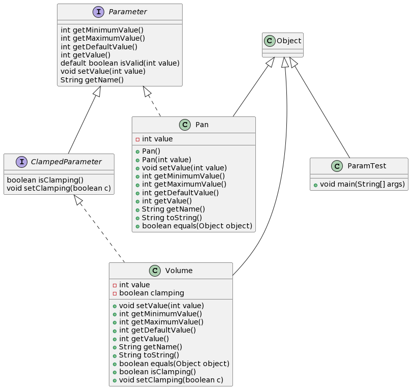

# ParameterTestJava

Polymorphism demo in Java.

## UML class diagram

[PlantUML class diagram](//www.plantuml.com/plantuml/png/tL9DRyCW3BtdLt3CXFeVActNVKYRUfbsS1EtOiBGWQagLVllWwIX9MZHpiibuFVyZ9-zzWoE0-ccKORHxQ13yG8E2EDDd1iHluY8FVAZCee2RK07REyA14w_80-uWw2vHefGFxB4rbgDO8Jo4LLzcwZ7n1jfHwjwuQVK6VZAJfbzKdu2IiBVjotTQw03zjVEyCHeUb_rUdt2a18bsx9u3a_CRYZLQV19pMJbv-qdTYmK7JGI6gvhhKJkORZBb1_BvVEyHxbiWLoOb5oObQocLMDbi7Ax3BCT3rCykufV0RHlBzROuHVj4vD_6wi3uOA5UOxBJgvonUuohd_iNycfDrV-TNSTq1jwdjj_lbKXKAOTN_V-8S3j_I2nZWc1TFC3)
